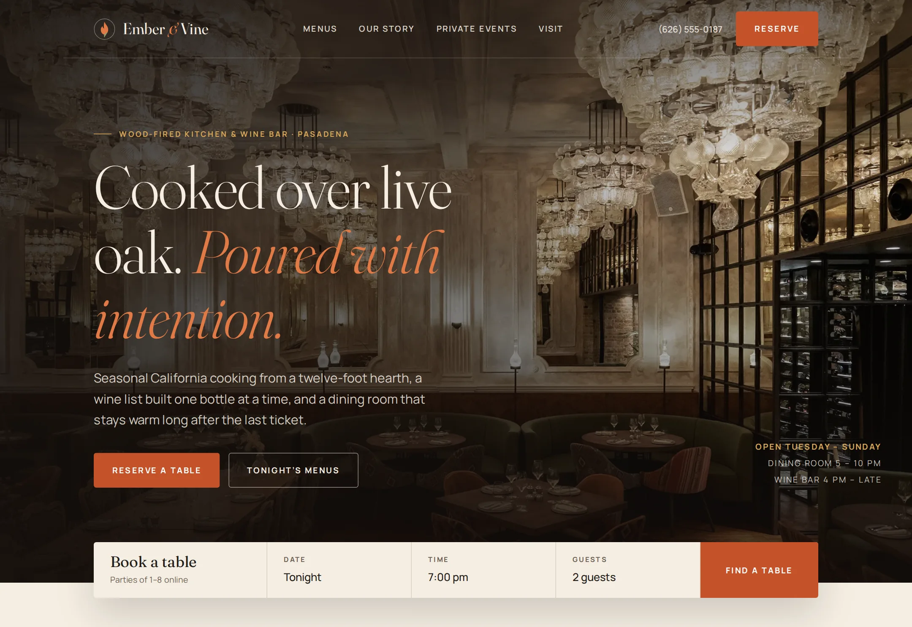

# Ember & Vine

Website for Ember & Vine, a wood-fired restaurant and wine bar on East Green Street in Pasadena, CA.

**Live demo:** https://www.freelancerportfoliohub.com/jameslee/projects/emberandvine/index.html



## Overview

This repository replaces the restaurant's old page-builder site with a fast, server-rendered Next.js
build. Menus, hours, event spaces and FAQs are typed data in `lib/data`, so the team edits one file
instead of re-uploading PDFs, and every page is built around the two things guests come for:
booking a table and planning an event.

Legacy WordPress URLs (old page slugs, `?page_id=` permalinks and PDF menu uploads) are
permanently redirected to their new homes so search rankings and printed QR codes keep working.

## Features

- **Five pages**: home with a booking bar under the hero, full menus with anchored sections and a
  sticky section nav, Our Story, Private Events and Visit (reservations, hours, map and FAQs)
- **Reservations**: the home booking bar hands off to the full form on `/visit`, which only offers
  time slots inside that night's dining room hours; `POST /api/reservations` validates with zod,
  checks per-slot capacity and suggests nearby times when a slot is full
- **Event enquiries**: structured date, headcount and occasion; `POST /api/enquiries` suggests the
  right room and forwards the lead to the events coordinator
- **Menus as HTML, not PDFs**: dietary badges (V, VG, GF), glass/bottle pricing and a `Menu`
  JSON-LD graph generated from the same data
- **Local SEO**: `Restaurant` JSON-LD with opening hours derived from `lib/data/hours.ts`,
  `sitemap.xml`, `robots.txt`, canonical URLs and per-page Open Graph tags
- **Migration redirects**: 29 permanent redirects from the previous WordPress site in
  `lib/data/redirects.ts`
- **Fast on a weak signal**: self-hosted variable fonts, WebP imagery through `next/image`,
  no third-party scripts; the mobile menu and FAQs are native `<details>` elements
- Checked at desktop and 390px mobile widths with no horizontal scroll

## Tech stack

- [Next.js 15](https://nextjs.org/) (App Router, route handlers, metadata API)
- React 19, TypeScript (strict)
- [zod](https://zod.dev/) for shared client/server validation
- Plain CSS with design tokens (`app/globals.css`), Fraunces and Manrope self-hosted

## Getting started

Requires Node 22 (see `.nvmrc`) and pnpm.

```bash
pnpm install
cp .env.example .env.local
pnpm dev
```

Open http://localhost:3000.

### Environment variables

| Variable                   | Purpose                                                          |
| -------------------------- | ---------------------------------------------------------------- |
| `NEXT_PUBLIC_SITE_URL`     | Canonical origin for metadata, sitemap and JSON-LD               |
| `RESERVATIONS_WEBHOOK_URL` | Receives reservation requests (floor team inbox automation)      |
| `EVENTS_WEBHOOK_URL`       | Receives private event enquiries                                 |
| `NEWSLETTER_WEBHOOK_URL`   | Adds subscribers to The Ember Letter                             |

Webhooks are optional in development; without them, submissions are logged to the server console.

## Project structure

```
.
├── app/
│   ├── about/              Our Story
│   ├── menus/              Dinner, dessert, wine, cocktails, Vine Hour
│   ├── private-events/     Spaces, inclusions, enquiry form
│   ├── visit/              Reservations, hours, map, FAQs
│   ├── api/                reservations, enquiries, newsletter route handlers
│   ├── sitemap.ts
│   ├── robots.ts
│   └── globals.css
├── components/
│   ├── layout/             Header, MobileNav, Footer, Brand
│   ├── home/ menus/ events/ visit/
│   ├── sections/           PageHero, SplitSection, CtaBand, FeatureGrid…
│   ├── seo/                JSON-LD components
│   └── ui/                 Button, Field, Section, DietBadge…
├── lib/
│   ├── data/               menus, hours, events, content, nav, redirects
│   ├── validation/         zod schemas shared by forms and API routes
│   ├── hours.ts            seating windows and Pasadena-local dates
│   ├── reservations.ts     reservation service
│   └── schema.ts           JSON-LD builders
├── public/                 images and fonts
├── types/
└── next.config.ts          redirects and security headers
```

## Updating content

- **Menus**: edit `lib/data/menus.ts`. Prices are numbers; wines take `{ glass, bottle }`.
- **Hours**: edit `lib/data/hours.ts`. The hours table, info strip, reservation slots and JSON-LD
  all read from it.
- **Event spaces**: edit `lib/data/events.ts`.

## Scripts

| Script           | Description                          |
| ---------------- | ------------------------------------ |
| `pnpm dev`       | Start the dev server with Turbopack  |
| `pnpm build`     | Production build                     |
| `pnpm start`     | Serve the production build           |
| `pnpm lint`      | ESLint (Next.js core web vitals)     |
| `pnpm typecheck` | TypeScript, no emit                  |
| `pnpm format`    | Prettier                             |
